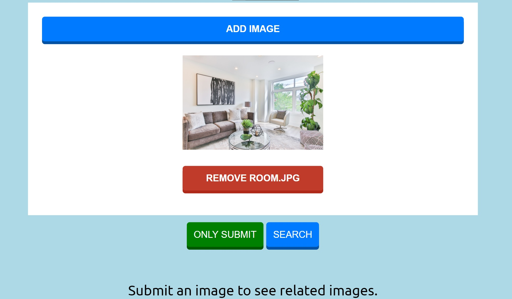

# How to run
- First of all download the weights file from [here](https://pjreddie.com/media/files/yolov3-spp.weights). And place it [object_detector/detect](object_detector/detect)
- Then install dependencies form requirements.txt file.
- After this run the [app.py](app.py) file. And open localhost:port on your browser.

# Interface
